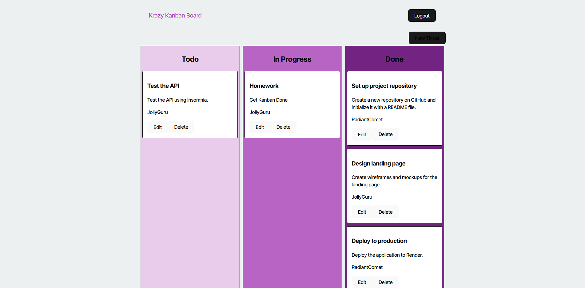

# KanBan Board

## Description
This project is a simple KanBan board application that helps you manage tasks efficiently. It allows you to create, update, and delete tasks, and move them across different stages such as "To Do", "In Progress", and "Done".

## Features
- Add new tasks
- Edit existing tasks
- Delete tasks

## Installation
Use the following link [here!](https://kanban-board-hw.onrender.com)
## Usage
Login and Start with your to do process.
